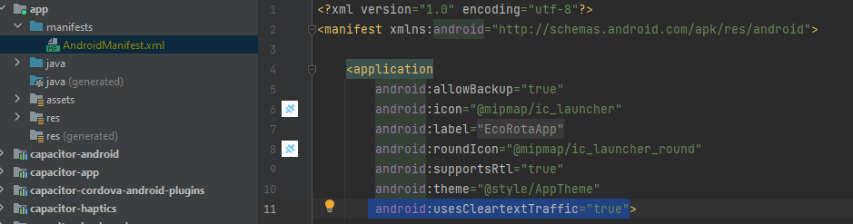

# 💡 Ideia do projeto
Frontend da aplicação EcoRota
- <b>Objetivo:</b> Auxiliar os usuários na escolha de opções de transporte sustentáveis, visando a redução da pegada de carbono nas viagens.


# 🛠 Gerando build para Android
1.  Crie ativos da Web e prepare seu aplicativo para qualquer destino de plataforma `ionic build [options]`
```
    ionic build
``` 
2. Adicione uma plataforma nativa ao seu projeto Ionic `ionic capacitor add [platform]`
````
    ionic capacitor add android 
````
3. Construir um projeto Ionic para uma determinada plataforma `ionic capacitor build [platform] [options]`
````
    ionic capacitor build android 
````
4. Abra o IDE para um determinado projeto de plataforma nativa `ionic capacitor open [platform]`
````
    ionic capacitor open android
````
<b>Obs: Alterar a variavel `environment.apiUrl` para o ip da maquina do backend</b>

# 🛠 Configuração do Android Studio 

Para liberar as requisições para qualquer dominio, adicione a propriedade `android:usesCleartextTraffic="true"` dentro da tag application, conforme imagem abaixo:



### 💻 Resultado

https://github.com/utzDaniel/EcoRotaApp/assets/78886472/e94d21ab-912e-4f42-b2b6-70688ef9101e

